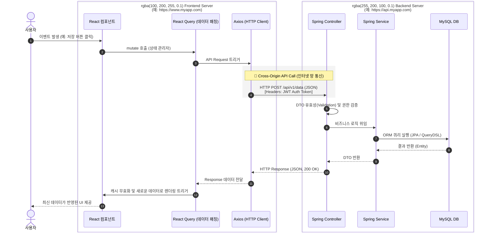

# React + Spring Boot 개발 환경 세팅 가이드

본 문서는 실무에서 가장 널리 쓰이는 조합 중 하나인 **React (프론트엔드)**와 **Spring Boot (백엔드)**를 활용하여, 소규모 팀이나 개인 프로젝트를 성공적으로 시작하고 무료 배포까지 완료하기 위한 표준 세팅 가이드입니다.

---

## 1. 개요 및 아키텍처 (Overview & Architecture)

### 1.1 프로젝트 목표 및 기술 스택 요약 (Standard Pick)
*   **Front-end:** React 18+, TypeScript, Vite, Zustand(상태관리), React Query(서버상태), Tailwind CSS, Axios
*   **Back-end:** Java 17/21, Spring Boot 3.x, Gradle, Spring Data JPA, QueryDSL, MySQL, Spring Security (JWT)
*   **DB & Cache:** MySQL(RDBMS), Redis(선택 - 토큰 및 캐시)
*   **Deploy / Infra:** GitHub Actions, Docker, Nginx, 무료 PaaS/IaaS (Koyeb, Render, Oracle Cloud)

### 1.2 워크스페이스 구조 설계
본 프로젝트는 시스템의 확장성과 독립성을 위해 프론트엔드와 백엔드를 물리적(폴더 단위)으로 분리하는 **독립 레포지토리/모듈 방식**을 채택합니다.
```text
project-root/ 
  ├── frontend/       <-- Vite & React 기반 코드 (npm / yarn)
  └── backend/        <-- Spring Boot 기반 코드 (Gradle)
```
*장점: 기술 스택의 혼재를 막고, 배포 인프라를 효율적으로 파편화(Vercel + EC2 등)할 수 있음.*

### 1.3 전체 시스템 아키텍처 다이어그램
1.  **Client:** Web Browser -> (HTTPS/REST API 연동) -> **Backend Server**
2.  **Backend:** Spring Boot (WAS) <---> MySQL (Database)
3.  **Deployment:** GitHub Push -> Action 빌드 -> Docker Image 생성 및 플랫폼 자동 배포

---

## 2. 필수 사전 준비 (Prerequisites)

### 2.1 개발 도구 설치
*   **에디터/IDE:** 
    *   프론트엔드: VS Code (권장 플러그인: ESLint, Prettier, Tailwind CSS IntelliSense)
    *   백엔드: IntelliJ IDEA (Community 또는 Ultimate)
*   **버전 관리:** Git 설치 및 GitHub 계정 연동

### 2.2 로컬 런타임 환경 구성
*   **Node.js:** v18 이상 LTS 버전 설치
*   **Java JDK:** Java 17 또는 21 설치 (Amazon Corretto, Adoptium 권장)

### 2.3 로컬 데이터베이스 셋업
로컬 PC를 오염시키지 않기 위해 **Docker**를 이용한 DB(MySQL, Redis) 실행을 권장합니다.
*   `docker-compose.yml`을 프로젝트 최상단에 구성하여 `docker-compose up -d` 명령어 하나로 DB 세팅을 완료합니다.

---

## 3. 백엔드 (Spring Boot) 환경 셋업 가이드

### 3.1 프로젝트 초기화
1.  [Spring Initializr](https://start.spring.io/) 접속
2.  Project: Gradle-Groovy(또는 Kotlin), Language: Java, Boot Version: 3.x.x
3.  Metadata: Group, Artifact 설정

### 3.2 핵심 의존성(Dependencies)
*   Sprinb Web, Spring Data JPA, MySQL Driver
*   Lombok (보일러플레이트 제거), Validation
*   Spring Security, JWT 라이브러리 (io.jsonwebtoken 등)

### 3.3 개발 편의성 및 보일러플레이트 제거
*   **QueryDSL 세팅:** `build.gradle`에 Q클래스 생성 스크립트를 추가하여 타입 세이프한 동적 쿼리 작성 환경을 구축.

### 3.4 API 및 보안 기반 세팅
*   **CORS 설정:** 로컬 React 서버(ex: `http://localhost:5173`)와의 통신을 위해 `WebMvcConfigurer`를 상속받거나 Security Filter단에서 전역 CORS를 허용(Allow Origin)합니다.
*   **JWT 인증 뼈대 마련:** `SecurityFilterChain`을 구성하여 세션(Stateless)을 비활성화하고, JWT 발급 및 검증 필터를 추가합니다.

### 3.5 API 문서 자동화
*   `springdoc-openapi-starter-webmvc-ui` 의존성 추가. 
*   앱 실행 후 `/swagger-ui.html`에 접속하여 API 문서를 프론트엔드 개발자와 실시간 공유.

### 3.6 데이터베이스 접근 기술 (ORM vs SQL Mapper) 장단점 비교
Spring Boot 환경에서 DB에 접근하는 방식은 크게 JPA(ORM)와 MyBatis(SQL Mapper, XML 방식)로 나뉩니다.

#### 1. Spring Data JPA (ORM) - **본 가이드 권장**
*   **개념:** 객체(Object)와 관계형 데이터베이스(RDB)를 매핑해주는 기술.
*   **장점:**
    *   **생산성 최상**: 기본적인 CRUD 쿼리를 작성할 필요 없이 인터페이스만으로 처리 가능(`findById`, `save` 등).
    *   **객체 지향적 접근**: DB 테이블 대신 자바 객체(Entity) 중심으로 비즈니스 로직 작성 가능.
    *   **유지보수 우수**: DB 테이블 컬럼이 변경되어도 자바 Entity 클래스와 속성만 수정하면 됨. (컴파일 단계에서 타입 에러 감지)
    *   **QueryDSL 결합**: 동적 쿼리 및 복잡한 조인을 타임 세이프(Type-safe)하게 Java 코드로 작성 가능하여 에러를 사전에 방지.
*   **단점:** 러닝 커브가 상당하며, 아주 복잡한 통계성 서브쿼리나 섬세한 네이티브 인덱스 튜닝은 직접 SQL을 작성하는 것보다 번거로울 수 있음.
*   **샘플 코드 (JPA):**
```java
// 1. Entity 클래스 (테이블 매핑)
@Entity
@Getter
@NoArgsConstructor(access = AccessLevel.PROTECTED)
public class Member {
    @Id @GeneratedValue(strategy = GenerationType.IDENTITY)
    private Long id;
    private String name;
    private String email;
}

// 2. Repository 인터페이스 (CRUD 쿼리 자동 생성)
public interface MemberRepository extends JpaRepository<Member, Long> {
    // 메서드 이름만으로 SELECT * FROM member WHERE email = ? 쿼리 생성
    Optional<Member> findByEmail(String email);
}

// 3. 연관관계 매핑 및 조인 (Join) 쿼리 샘플
@Entity
@Getter
@NoArgsConstructor(access = AccessLevel.PROTECTED)
public class Post {
    @Id @GeneratedValue(strategy = GenerationType.IDENTITY)
    private Long id;
    private String title;
    
    // N:1 연관관계 매핑 (Member 테이블과 연결)
    @ManyToOne(fetch = FetchType.LAZY)
    @JoinColumn(name = "member_id")
    private Member member;
}

public interface PostRepository extends JpaRepository<Post, Long> {
    // @Query를 사용한 Fetch Join (2개 테이블의 요소를 지연로딩 없이 한 번에 조회)
    // SQL: SELECT p.*, m.* FROM post p INNER JOIN member m ON p.member_id = m.id WHERE p.title LIKE ...
    @Query("SELECT p FROM Post p JOIN FETCH p.member m WHERE p.title LIKE %:keyword%")
    List<Post> findByTitleWithMember(@Param("keyword") String keyword);
}
```

#### 2. MyBatis (SQL Mapper - XML 쿼리 방식)
*   **개념:** SQL 쿼리를 XML 파일이나 어노테이션에 완전히 분리하여 수기로 작성하고 결과를 DTO 리스트에 매핑.
*   **장점:**
    *   **세밀한 SQL 제어**: 원하는 SQL을 100% 직접 튜닝하고 작성할 수 있어 DBA 및 레거시 기반 조직에 매우 친화적임.
    *   통계 대시보드 및 복잡한 다중 테이블 조인이 난무하는 쿼리 작성 시 매우 직관적.
*   **단점:** 
    *   **생산성 감소**: 아무리 단순한 INSERT, SELECT(CRUD) 쿼리도 모두 문자열(XML)로 일일이 작성해야 함.
    *   **유지보수 고통**: 테이블 컬럼 하나가 추가/변경되면 관련된 모든 XML 문서의 쿼리 라인들을 찾아가 수정해야 함.
    *   **런타임 에러 위험 발생**: SQL이 '문자열' 형태이므로 스펠링 오타나 컬럼명 불일치 에러를 컴파일 타임이 아닌 런타임(실행) 시점에서야 파악하게 됨.
*   **샘플 코드 (MyBatis XML 방식):**
```java
// 1. Mapper 인터페이스
@Mapper
public interface MemberMapper {
    MemberDto findByEmail(@Param("email") String email);
}
```
```xml
<!-- 2. Mapper XML 파일 -->
<?xml version="1.0" encoding="UTF-8"?>
<!DOCTYPE mapper PUBLIC "-//mybatis.org//DTD Mapper 3.0//EN" "http://mybatis.org/dtd/mybatis-3-mapper.dtd">
<mapper namespace="com.example.mapper.MemberMapper">
    <select id="findByEmail" resultType="com.example.dto.MemberDto">
        SELECT id, name, email
        FROM member
        WHERE email = #{email}
    </select>
</mapper>
```

#### 3. JdbcTemplate (순수 DB 템플릿)
*   **장점:** 백엔드 레이어 세팅이 매우 간단하고 오버헤드가 적어 빠름.
*   **단점:** JDBC 연결과 데이터 매핑에서 발생하는 보일러플레이트 코드가 너무 많아 실무 핵심 로직에서는 점차 사용을 지양하는 추세.
*   **샘플 코드 (JdbcTemplate):**
```java
@Repository
@RequiredArgsConstructor
public class MemberRepository {
    private final JdbcTemplate jdbcTemplate;

    public Optional<MemberDto> findByEmail(String email) {
        String sql = "SELECT id, name, email FROM member WHERE email = ?";
        List<MemberDto> results = jdbcTemplate.query(sql, (rs, rowNum) -> {
            MemberDto dto = new MemberDto();
            dto.setId(rs.getLong("id"));
            dto.setName(rs.getString("name"));
            dto.setEmail(rs.getString("email"));
            return dto;
        }, email);
        return results.stream().findFirst();
    }
}
```

---

## 4. 프론트엔드 (React) 환경 셋업 가이드

### 4.1 스캐폴딩 (Vite)
```bash
npm create vite@latest frontend -- --template react-ts
cd frontend && npm install
```

### 4.2 주요 라이브러리 및 패키지 셋업
*   `npm install axios zustand @tanstack/react-query react-router-dom`

### 4.3 상태 관리 및 데이터 패칭
*   **React Query:** 핵심 데이터를 패칭하고 캐싱하는 로직 중앙화 (ex: 게시글 목록 등).
*   **Zustand:** 다크모드, 사이드바 토글, 로그인 유저 정보 등 가벼운 전역 State 관리.

### 4.4 스타일링 (Tailwind CSS)
```bash
npm install -D tailwindcss postcss autoprefixer
npx tailwindcss init -p
```
*   `tailwind.config.js` 및 `index.css` 수정 적용.

### 4.5 HTTP 클라이언트 (Axios)
*   Axios 글로벌 인스턴스를 하나 만들고, 로그인 토큰(지연된 로딩)을 싣어보내는 **Interceptor**를 작성하여 헤더(Authorization)를 자동화.

---

## 5. 프론트-백엔드 연동 및 로컬 테스트 (Local Integration)

### 5.1 로컬 API 프록시 우회
React의 `vite.config.ts`에서 `/api` 패턴을 감지하여 Spring Boot(`http://localhost:8080`)로 우회(Proxy)하게 설정하면 CORS 에러 없이 로컬 테스트가 가능합니다.

### 5.2 실행
서로 다른 터미널을 열고 다음을 실행합니다.
*   Backend: `./gradlew bootRun`
*   Frontend: `npm run dev`

### 5.3 프론트-백엔드 Call Flow (동작 흐름)
사용자 화면에서 이벤트(예: 클릭)가 발생하여 백엔드 데이터베이스를 거쳐 다시 프론트엔드 UI로 렌더링되기까지의 호출 흐름을 나타낸 시퀀스 다이어그램입니다.



---

## 6. 프로덕션 빌드 및 배포 인프라 셋업 (Deployment & Infra)

### 6.1 클라우드 무료 배포 전략 선정
포트폴리오나 소규모 토이 프로젝트 운영 시 비용 부담을 0으로 유지하면서도 안정적인 서비스를 제공하기 위한 배포 전략입니다. 
프론트엔드와 백엔드는 각각의 생태계에 최적화된 호스팅 서비스를 결합(Decoupling)하여 사용하는 것이 효율적입니다.

### 🧩 프론트엔드 (React) 배포 플랫폼
프론트엔드는 정적 자산(Static Assets) 호스팅에 특화된 CDN 기반의 플랫폼을 사용하는 것이 압도적으로 유리합니다.

#### 1. Vercel (React 생태계의 표준)
*   **무료 혜택:** 무제한에 가까운 트래픽(대역폭 100GB/월), 무제한 웹사이트 호스팅, 전 세계 CDN 엣지 네트워크 배포 가속.
*   **장점:** React/Vite 프로젝트를 위해 만들어진 것처럼 설정이 아예 없거나 원클릭으로 끝납니다. GitHub 푸시 시 자동으로 브랜치별 프리뷰(미리보기) 사이트를 만들어주는 기능이 매우 강력합니다.
*   **단점/유의사항:** 상업적 목적의 사용은 무료(Hobby) 티어에서 엄격히 금지됩니다. 순수 정적 파일(.html, .js) 기준으로는 단점이 없다고 봐도 무방합니다.

#### 2. Netlify (Vercel의 강력한 대안)
*   **무료 혜택:** Vercel과 유사한 관대한 대역폭(100GB/월) 및 무제한 호스팅 지원, 막강한 폼(Form) 핸들링 기본 탑재.
*   **장점:** CI/CD 설정이 세밀하며, 서버리스 함수(Functions)나 리다이렉트 설정(`_redirects`)이 Vercel 대비 조금 더 직관적일 때가 있습니다.
*   **단점/유의사항:** 최근 들어 Vercel이 React 생태계 주도권을 가져가면서, React 최신 기능 지원 속도는 Vercel에 비해 살짝 아쉬울 수 있습니다. (하지만 Vite+React 기반 정적 배포라면 큰 차이 없음).

### ⚙️ 백엔드 (Spring Boot) 배포 플랫폼
Spring Boot(Java)는 메모리 소모량이 있으므로 목적에 맞는 적절한 무료 호스팅 선택이 필요합니다.

#### 1. Koyeb (최근 가장 추천하는 PaaS)
*   **무료 혜택:** 1개의 Web Service, 512MB RAM, 0.1 vCPU 제공.
*   **장점:** 타 무료 플랫폼과 달리 **슬립(Sleep) 정책이 없어** 24시간 내내 첫 요청(Cold Start) 지연 없이 빠른 쾌적한 응답 속도를 유지합니다. GitHub과 연동 시 푸시마다 자동 배포(CI/CD)되며 Docker 기반 운영이 매우 편리합니다.
*   **단점 및 유의사항:** 512MB RAM은 Spring Boot 3 버전을 띄우기에 타이트합니다. JVM 메모리 튜닝(7.2 항목 참조)이 필수적입니다.

#### 2. Render (가장 대중적이고 쉬운 PaaS)
*   **무료 혜택:** 웹 서비스 연동 무료, 512MB RAM, 무료 PostgreSQL DB(90일 한정) 제공.
*   **장점:** 인터페이스가 매우 직관적이고 설정이 편해 Vercel의 백엔드 버전이라 불릴 만큼 사용자 경험이 편합니다.
*   **단점:** **오토 슬립(Auto-sleep)** 정책이 있습니다. 15분 이상 트래픽이 없으면 서버가 대기 상태로 전환되며, 이후 첫 접속 시 서버가 깨어나는 데(Cold Start) 30초에서 최대 1분 정도 지연될 수 있습니다.

#### 3. Oracle Cloud - Always Free (최강의 성능, IaaS)
*   **무료 혜택:** 최대 **24GB RAM, 4개 ARM vCPU**, 200GB 디스크 등 (평생 무료).
*   **장점:** 타의 추종을 불허하는 압도적인 무료 스펙입니다. 프론트엔드 웹 서버(Nginx) + Spring Boot 백엔드 + 여러 대의 데이터베이스(MySQL, Redis 등)를 하나의 가상 서버 환경에 모두 띄우고도 남습니다.
*   **단점:** 클라우드 컴퓨팅(리눅스, 방화벽 통신망 세팅, Nginx 배포 등)의 아키텍처를 0부터 직접 세팅해야 하여 러닝 커브가 있습니다. (하지만 훌륭한 인프라 학습 포트폴리오가 됩니다.)

**💡 [배포 전략 요약 추천]**
*   **최고의 편의성 (버튼 클릭 위주):** 프론트(Vercel) + 백엔드(Koyeb) + DB(외부 클라우드 DB 서비스 연동)
*   **최고의 성능 & 인프라 아키텍처 구축 경험:** Oracle Cloud 가상 서버를 발급받아 내부에 통째로 컨테이너 일괄 구축

### 6.2 Docker 기반 컨테이너화
`backend/Dockerfile` 작성 예시:
```dockerfile
# 백엔드 빌드 및 실행 분리 (Multi-stage)
FROM openjdk:17-jdk-slim AS builder
# ... gradle 빌드 ...
FROM openjdk:17-jdk-slim
COPY --from=builder /app/build/libs/*.jar app.jar
ENTRYPOINT ["java", "-jar", "/app.jar"]
```

### 6.3 데이터베이스 배포 및 프로파일(Profile) 분리
*   로컬용 `application-local.yml` (Docker DB 연결)과 배포용 `application-prod.yml` (클라우드 DB 연동)을 환경 변수로 안전하게 주입/분리.

### 6.4 CI/CD 기반 자동화 (GitHub Actions)
`.github/workflows/deploy.yml` 작성. 코드가 Main 브랜치에 푸시되면 자동으로:
1. Java 코드를 빌드.
2. 테스트 수행.
3. 배포(Docker Hub 푸시 후 원격 서버 반영 등).

### 6.5 클라우드 DBMS 선택 및 활용 가이드
서버 배포(PaaS)와 데이터베이스 배포 인프라를 분리하는 것이 추후 확장성 관리에 좋습니다. 자금 부담이 없는 훌륭한 클라우드 DB 리스트입니다.

#### 1. Supabase (PostgreSQL 기반, BaaS) - **적극 추천**
*   **개요:** Firebase의 강력한 오픈소스 대안이며 백그라운드 코어로 견고한 PostgreSQL을 사용합니다.
*   **장점 (무료 티어 최고수준):**
    *   500MB의 DB 여유 공간 및 넉넉한 연결(Connection) 수 허용.
    *   단순 DB 인스턴스 렌탈을 넘어서 무제한 밴드위스의 강력한 스토리지(AWS S3 대안), 자체 Authentication(소셜 로그인 연동 탑재), 실시간 웹소켓 폴링 처리 지원 등 광범위한 기능을 보유합니다.
    *   Spring Boot(JPA)와 충돌 없이 Java의 PostgreSQL 드라이버(`org.postgresql:postgresql`) 설정 한 줄만으로 100% 완벽히 연동됩니다.
*   **단점:** MySQL과 문법 및 내부 설계 함수 차이가 미세하게 있으나(예: AUTO_INCREMENT가 아닌 시퀀스 등), JPA 기반이라면 프레임워크가 알아서 처리하므로 전혀 체감되지 않는 단점입니다.

#### 2. PlanetScale (MySQL 호환 - 최근 무료티어 축소)
*   **특징:** 강력한 스케일링을 자랑하는 서버리스 MySQL 벤더입니다.
*   **유의사항:** 예전엔 첫번째 추천픽이었지만, 정책 변경으로 무료 티어(Hobby)가 사실상 폐지되어 소규모 토이프로젝트 용도로는 쓸 수 없게 되었습니다.

#### 3. Aiven, TiDB Serverless (MySQL 최신 대안)
*   **특징:** MySQL 호환 서버리스 DB를 무료 티어로 제공하는 업체들입니다.
*   **장점:** 기존 레거시 MySQL 쿼리를 100% 복붙하여 사용해야만 할 때 유용합니다. 
*   **단점:** 종종 프리 티어 생성 제약이 빡빡하며, 한국 Region이 막혀 있어 타 국가 리전할당으로 인해 레이턴시(지연)가 튈 수 있습니다.

#### 4. AWS RDS / Oracle Cloud (IaaS 인프라 활용)
*   **AWS RDS:** 1년간 프리 티어 제공(학습용으로 좋음). 그러나 깜빡하면 1년 뒤 과금 폭탄 위험이 존재합니다.
*   **Oracle Cloud:** 평생 무료 가상서버(VM) 안에 직접 Docker MySQL 컨테이너를 올려서 사용. 비용은 완전 무료지만 리눅스 세팅과 백업, 방화벽 관리가 꽤 수고롭습니다.

> 💡 **추천 결론:** 백엔드 코드가 JPA(ORM)로 짜여 있다면 특정 DB 벤더(MySQL)의 쿼리 제약이 완전히 사라집니다. 부수적인 부가 기능과 대시보드가 완벽하고 현재 무료 티어가 가장 쾌적하게 유지되는 **Supabase (PostgreSQL)** 인스턴스를 Data Source로 연결하는 것이 가장 스마트한 선택입니다.

---

## 7. 트러블슈팅 및 팁 (Troubleshooting & Tips)

### 7.1 자주 발생하는 오류
*   **CORS:** 백엔드에서 허용 했으나 프록시 환경 혹은 배포 시 도메인 정보가 달라 발생. 정확한 Origin 기입 요망.
*   **Cold Start:** 무료 서버 환경 특성상 1~2분 접속 지연 발생 가능. (Koyeb은 이 문제가 적음).

### 7.2 메모리 환경(512MB RAM)에서의 JVM 튜닝 팁
무료 PaaS 배포 시 메모리 오버로드(OOM) 방지를 위해 Dockerfile Entrypoint에 다음을 권장:
*   `ENTRYPOINT ["java", "-Xmx300m", "-Xss512k", "-XX:+UseSerialGC", "-jar", "/app.jar"]`
*   가벼운 Serial GC를 쓰고 최대 Heap을 300MB 정도로 묶어 플랫폼의 512MB 한도를 넘지 않게 조절.

---

## 8. 실무 개발 및 배포 시 핵심 고려사항 (Checklist)

### 8.1 프론트엔드 상태 관리(Zustand / React Query) 목적 명확화
*   **React Query:** 서버 상태 전용. 전적으로 서버 API로부터 가져온 데이터의 비동기 패칭, 업데이트 시 낙관적(Optimistic) UI 처리, 로딩/에러 렌더링, 캐싱 작업(예: 게시글 목록 데이터)에만 사용합니다.
*   **Zustand:** 클라이언트 상태 전용. 순수한 로컬 UI 상태(예: 모달 팝업 ON/OFF 여부, 다크모드 설정, 사이드바 토글 상태 등) 관리에만 쓰도록 엄격하게 컴포넌트 간 역할을 분리해야 코드가 꼬이지 않습니다.

### 8.2 CORS 설정 및 Proxy 우회
프론트엔드(5173 포트)와 백엔드(8080 포트) 간 오리진(Origin) 분리로 인해 필연적으로 발생하는 브라우저단 에러입니다.
*   **로컬 개발 환경:** 프론트엔드 `vite.config.ts` 파일 내부에서 `/api` 패턴 호출을 감지해 도메인을 `http://localhost:8080`으로 바꿔치는 **프록시(Proxy)** 설정이 가장 안정적입니다.
*   **운영 배포 환경:** Spring Config 내에서 `WebMvcConfigurer` 또는 `CorsConfigurationSource` 로직을 구현하여, 클라우드에 실제 배포될 프론트엔드의 도메인 주소(예: https://my-app.vercel.app)를 명시적으로 허용(`AllowOrigins`)해야 합니다.

### 8.3 QueryDSL Q클래스 및 Git 버전 관리 주의
*   JPA 동적 쿼리를 위해 QueryDSL 세팅 시 자동 생성(Generated)되는 `QEntity.java` 클래스들은 빌드에 의한 런타임 컴파일 산출물입니다.
*   **절대 GitHub Repository에 커밋되지 않도록** `.gitignore` 경로에 `src/main/generated` 또는 `build/generated` 와 같은 타겟 폴더를 등록하세요. 협업자 간 심각한 코드 충돌을 미연에 방지해야 합니다.

### 8.4 비밀정보(Secret Key / DB Password) 하드코딩 지양 및 프로파일 주입
*   JWT 서명을 위한 시크릿 문자열이나, DB 접속 호스트/비밀번호 정보는 절대 `application.yml`에 평문(Plain Text)으로 작성하여 깃허브에 푸시하지 마십시오.
*   `application-local.yml` / `application-prod.yml` 환경으로 분할하고, 설정값은 `${DB_PASSWORD}` 형태로 플레이스홀더만 걸어둔 채, 실제 배포 플랫폼의 전역 환경설정(Environment Variables) 창에서 실제 변수값을 주입하도록 인프라 아키텍처를 강제하세요.

### 8.5 서버 첫 접속 지연 (Cold Start) 대처 및 UX 설계
*   Render를 비롯한 대다수 무료 호스팅 서버들은 활용되지 않을 때 요금을 절약하려 프로세스를 슬립 상태로 전환합니다(Auto-sleep). 다시 깨어날 때(Cold Start) 대략 1분 가까운 시간 동안 서버가 멈춘 것처럼 보일 수 있습니다.
*   회원가입 등 최초 백엔드 API 요청 시 프론트엔드에 단순 스피너를 보여주는 걸 넘어서, _"서버 예열을 위해 초기 로딩에 약 30초~1분 정도 소요될 수 있습니다."_ 와 같은 텍스트 기반 **가이드형 로더 UI를 섬세하게 설계**하여 사용자가 브라우저를 먼저 끄지 않도록 배려해야 합니다.
