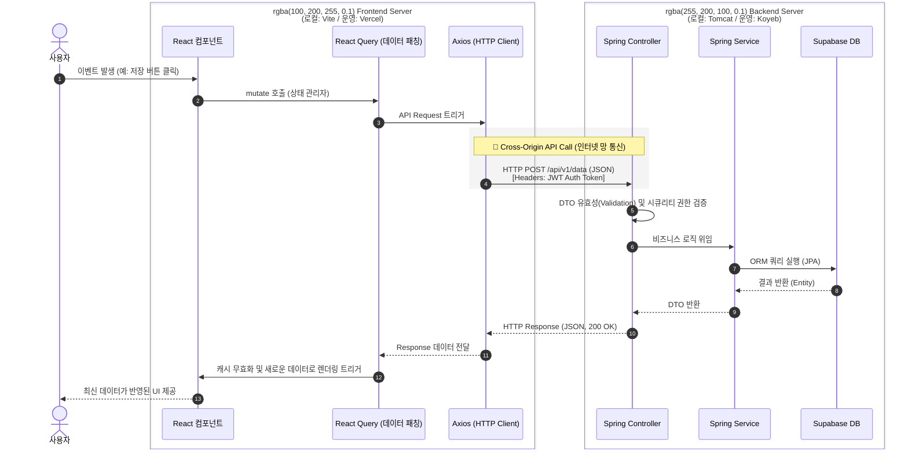

# React + Spring Boot 개발환경 정의서

본 문서는 `react-springboot_개발환경_세팅가이드.md`를 기반으로, 실제 로컬 PC(`C:\AI_DEV\REACT_SPRING`)에 구축이 완료되고 연동 및 테스트가 성공적으로 승인된 최종 개발 환경 스펙과 연동 방식을 상세히 정의합니다.

이 문서는 프로젝트 운영 간 환경 설정 추적, 트러블슈팅, 및 새로운 팀원 합류 시 온보딩(Onboarding)을 위한 표준 환경 지침서 역할을 수행합니다.

---

## 1. 프로젝트 개요 및 구조

### 1.1 프로젝트 아키텍처 (Loose Coupling)
본 프로젝트는 시스템의 확장성, 보안성, 그리고 독립적인 프론트엔드/백엔드 배포(분리 배포)를 위해 물리적인 폴더와 런타임을 완전히 분리한 형태를 취합니다.

*   **최상위 루트 디렉토리**: `C:\AI_DEV\REACT_SPRING`
*   **통신 방식**: Stateless REST API (`localhost:5173` -> `localhost:8080`)

### 1.2 프론트엔드 아키텍처 진단 및 향후 확장 계획 (Monorepo)
현재 구축된 프론트엔드 환경은 단일 메인 서비스의 빠른 구현에 최적화된 **SPA(Single App) 아키텍처**입니다. 향후 비즈니스가 B2B 솔루션 확장 등 다중 테넌트(Multi-Tenant) 구조로 성장할 경우를 대비하여 아래와 같이 확장 및 마이그레이션 계획을 병기합니다.

#### 1) 📦 현재 구조 (Single App 구조)
단일 프로덕트를 가장 직관적이고 빠르게 개발할 수 있는 구조입니다.
*   **패키지 매니저:** `npm` (독립적인 `node_modules` 존재)
*   **구조:** `frontend` 폴더 하나에 모든 리소스(UI 컴포넌트, 상태관리, 비즈니스 로직)가 집중된 Monolith SPA 형태입니다.
*   **빌드 도구:** 단일 `Vite` 환경 사용
*   **적합성:** 하나의 거대한 서비스 사이트(예: 메인 포털, 관리자 통지 데스크 등 1~2개 이내의 서비스)를 집중 개발할 때 최고의 가성비를 발휘합니다.

#### 2) 🚀 향후 확장 구조 (Turborepo 기반 Monorepo 아키텍처)
향후 회사의 솔루션이 여러 고객사(테넌트)별로 "브랜드/테마/일부 권한만 다르고 뼈대는 비슷한 앱 10개"를 동시에 배포해야 하는 형태로 진화할 경우, 현재 구조로는 코드 중복(수십 개의 레포지토리 관리 지옥)이 발생합니다. 이때 아래 구조로 마이그레이션을 추진합니다.
*   **패키지 매니저 교체:** 중앙에 글로벌 Store를 하나 두고 심볼릭 링크로 패키지를 당겨 쓰는 **`pnpm`**으로 교체하여 의존성 중복 방지 및 모노레포 워크스페이스 기능을 활성화합니다.
*   **구조 개편:** 
    *   `apps/` 하위 폴더: HDPM, KDPM, GDPM 처럼 브랜드나 테넌트별로 따로 배포할 독립적 Vercel 타겟 앱들 생성
    *   `packages/` 하위 폴더: **공통 UI 컴포넌트**(`@dpm/ui-component`), **공통 상태관리**(`@dpm/state`), **공통 차트모듈**(`@dpm/charts`) 등을 자체 npm 라이브러리처럼 모듈화하여 배치. 디자인 시스템(ex: Ant Design 탑재 등)을 이 공통 패키지에 심어두면 10개의 테넌트 앱이 한 번에 동일한 테마를 상속받습니다.
*   **빌드 도구 편입:** **`Turborepo`** 를 최상단에 세팅. 이를 통해 수정되지 않은 공통 UI는 빌드하지 않고 캐시된 리소스를 반환함으로써 수많은 서비스 앱들이 찰나의 시간 안에 병렬형 스피드 빌드로 Vercel에 배포될 수 있게 구성합니다.

### 1.3 하위 디렉토리 구조 및 용도 설명
프로젝트 내의 핵심 워크스페이스 구조와 각 디렉토리의 역할은 아래와 같습니다.

```text
C:\AI_DEV\REACT_SPRING/ 
  ├── .vscode/                 <-- [공통 설정] 프로젝트 전체 VS Code 환경설정 (Java 버전 명시 등)
  │
  ├── frontend/                <-- [React 앱] SPA 방식의 사용자 인터페이스 코드 (Node.js/npm 기반)
  │   ├── node_modules/        <-- npm 모듈 의존성 저장소 (git 추적 제외)
  │   ├── public/              <-- 파비콘 등 정적 에셋 (빌드 시 루트에 바로 복사됨)
  │   ├── src/                 <-- 실제 React 코드 작업 영역
  │   │   ├── api/             <-- Axios 기반 HTTP 클라이언트 및 인터셉터 (axiosSetup.ts)
  │   │   ├── assets/          <-- 컴포넌트에서 import 하는 지역 이미지 파일 등
  │   │   ├── App.tsx          <-- 최상위 라우팅 및 뷰 진입점 컴포넌트
  │   │   ├── index.css        <-- Tailwind CSS 글로벌 스타일 초기화 파일
  │   │   └── main.tsx         <-- React DOM 렌더링 부트스트랩 스크립트
  │   ├── index.html           <-- Vite 진입 메인 HTML 페이지
  │   ├── package.json         <-- 프론트엔드 의존성, 스크립트 명세 파일
  │   ├── tailwind.config.js   <-- Tailwind CSS 유틸리티 설정
  │   └── vite.config.ts       <-- Vite 빌드 도구 및 Proxy(CORS 우회) 설정
  │
  └── backend/                 <-- [Spring Boot 앱] 비즈니스 로직 및 DB 처리 코어 (Gradle 기반)
      ├── .vscode/             <-- 백엔드 언어 서버(Language Server)용 Java 17 강제 설정
      ├── build/               <-- Gradle 빌드 산출물 및 QueryDSL Q-Class 자동 생성 위치
      ├── gradle/wrapper/      <-- 내장 빌드 도구 래퍼 (시스템 Gradle 버전과 독립적으로 동작)
      ├── src/main/java/com/example/backend/
      │   ├── config/          <-- Spring Security, CORS, Swagger 자동 구성 등 설정 클래스
      │   ├── controller/      <-- API 엔드포인트 정의 (프론트 통신 접점, ex: TestController)
      │   ├── domain/          <-- 비즈니스 도메인 Entity 패키지 (ex: Member)
      │   └── repository/      <-- Spring Data JPA DB 조작 인터페이스 (ex: MemberRepository)
      ├── src/main/resources/  
      │   ├── application.yml        <-- Spring Boot 전역 및 기본 프로파일 설정 파일
      │   ├── application-local.yml  <-- 로컬 개발용(Supabase 연결) DB 연결, JWT 시크릿 등
      │   └── application-prod.yml   <-- 실 운영 배포(Production) 시 쓰일 환경변수 템플릿
      ├── build.gradle         <-- 백엔드 의존성(JPA, PostgreSQL, JWT 등) 명세 빌드 파일
      └── gradle.properties    <-- Gradle Daemon 로컬 환경 변수 (org.gradle.java.home=Java17 강제)
```

---

## 2. 기술 스택 (Tech Stack) 확정 사양

기존 `세팅가이드.md`에서 논의되었던 옵션 중 실제 현재 프로젝트에 탑재되어 구동이 확정된 사양입니다.

### 2.1 Backend (Spring Boot Core)
*   **프레임워크**: Spring Boot 3.4.0 (최신 안정화 버전)
*   **언어 환경**: Java 17 (Amazon Corretto 또는 Eclipse Adoptium)
    *   *로컬 개발 시 시스템 환경 변수(Java 8) 충돌을 막기 위해 `gradle.properties`에 Java 17 경로를 강제로 고정했습니다.*
*   **빌드 도구**: Gradle (Groovy DSL)
*   **DB 컨트롤**: Spring Data JPA + QueryDSL(5.0.0, Jakarta 호환) 기반의 **객체 지향 매핑(ORM)** 방식 채택
*   **클라우드 데이터베이스**: PostgreSQL 호환 **Supabase** (aws-1-ap-northeast-2.pooler.supabase.com)
*   **보안 파이프라인**: Spring Security + JWT 토큰 (Stateless Session 정책 유지)
*   **API 자동화**: Swagger / OpenAPI (springdoc-openapi-starter-webmvc-ui 2.5.0)

### 2.2 Frontend (React UI)
*   **프레임워크**: React 18+ (Vite 스캐폴딩 5버전 채택하여 폴더 권한 락킹 현상 회피)
*   **언어 환경**: TypeScript (안전한 타입 체크 및 백엔드 DTO 동기화 목적)
*   **패키지 관리자**: NPM (Node.js 18.x 이상 지원)
*   **스타일링**: Tailwind CSS v3 (유틸리티 퍼스트) + PostCSS
*   **상태 관리 로직**: Zustand (글로벌 UI 상태) / React Query (서버 사이드 상태 및 캐싱)
*   **비동기 처리(HTTP)**: Axios (JWT 토큰 자동 주입용 글로벌 `apiClient` 인터셉터 구성 완료)

---

## 3. 핵심 환경 세팅 값 및 위치 지침

이 섹션은 프로젝트를 껐다 켜거나, 환경이 꼬였을 때 직접 눈으로 확인하고 튜닝해야 하는 **설정 파일(Configuration)의 위치와 핵심 가이드**를 명시합니다.

### 3.1 CORS (교차 출처 리소스 공유) 처리 위치
프론트엔드 URL과 백엔드 URL이 달라서 브라우저가 통신을 막아버리는 현상을 방지하는 설정들입니다.

#### A. 프론트엔드 프록시 (로컬 개발용 우회)
*   **위치:** `frontend/vite.config.ts`
*   **가이드:** 프론트엔드 코드 내에서는 `http://localhost:8080/api/test` 라고 하드코딩하지 않습니다. 단순히 `/api/test` 로 호출하면 Vite 개발 서버가 `vite.config.ts`의 proxy 설정(`target: 'http://localhost:8080'`)을 보고 알아서 백엔드로 요청을 패스워딩합니다.

#### B. 백엔드 시큐리티 개방 (동작 및 배포용 인증)
*   **위치:** `backend/src/main/java/com/example/backend/config/SecurityConfig.java`
*   **가이드:** 
    *   `corsConfigurationSource()` 빈 내부에서 `config.setAllowedOrigins(List.of("http://localhost:5173"));` 와 같이 명시된 허용 목록을 통해 방화벽을 엽니다. 실 배포 시에는 이 배열 안에 Vercel이나 웹 배포 도메인 주소(예: `https://my-domain.com`)가 추가되어야 합니다.
    *   `requestMatchers("/api/auth/**", "/api/test").permitAll()` 부분을 통해 로그인이 없어도 뚫고 들어올 수 있는 개방형 API를 정의합니다. 지정되지 않은 모든 요청은 403 Forbidden을 반환합니다.

### 3.2 데이터베이스(Supabase) 및 JWT 보안 키 주입 위치
개인 정보가 포함된 접속/비밀번호 데이터들입니다. 깃허브 오픈소스화 시 절대 `application.yml` 원본 파일에 하드코딩으로 남겨두지 마십시오.

*   **위치:** `backend/src/main/resources/application-local.yml`
*   **기본 구조 동작**: `application.yml`은 `active: local`을 잡아주는 컨트롤러 역할만 하며, 실제 물리적인 비밀 정보는 `application-local.yml`을 우선적으로 바라봅니다.
*   **가이드:**
    *   **DB 접속:** `spring.datasource.url` 및 `username`, `password` 란에 현재 발급받은 실제 Supabase PostgreSQL 크레덴셜이 적혀서 통신중입니다. 
    *   **DB 테이블 자동화:** `spring.jpa.hibernate.ddl-auto: update` 옵션을 통해, 개발자가 자바의 `@Entity` 클래스를 수정하고 서버를 켜면 DB 테이블 구조를 프레임워크가 알아서(Alter/Create) 조작합니다. (단, 운영서버 배포 시 `application-prod.yml`에서는 반드시 `validate`로 묶어 DB 파괴를 막아야 합니다.)
    *   **JWT 키:** `jwt.secret` 값에 암호화 시드 문자열이 들어가 있습니다. 이 키가 탈취되면 외부에서 가짜 로그인 토큰을 생성할 수 있으므로 관리 주의가 필요합니다.

### 3.3 백엔드 빌드(Java 경로) 분리 위치
VS Code가 사용하는 글로벌 환경 변수(PC 본체의 Java 8)와 충돌하는 현상을 프로젝트 내부로 락킹하여 해결한 설정입니다.

*   **위치 1 (언어 서버 보조):** `backend/.vscode/settings.json`의 `java.jdt.ls.java.home` (VS Code 내의 자동완성, 문법 검사용 Java 컴파일러 버전을 17로 지정)
*   **위치 2 (실제 빌드 강제):** `backend/gradle.properties`의 `org.gradle.java.home` (터미널에서 `./gradlew bootRun`을 할 때 어떤 자바를 써서 데몬을 잡을지 강제 지정)
*   **가이드:** 다른 개발자의 PC에서 프로젝트를 열었을 때 경로가 다르다면 이 파일부터 먼저 그 사람의 PC 사정에 맞춰 수정해주거나 파일 자체를 각자의 랩탑만 바라보게끔 삭제(`.gitignore`) 처리해도 무방합니다.

### 3.4 프론트엔드 API 호출 글로벌 모듈화 위치
*   **위치:** `frontend/src/api/axiosSetup.ts`
*   **가이드:** 리액트 컴포넌트 내에서 데이터를 가져오거나 넘길 때 순수 `axios` 모듈을 쓰지 말고, 이 파일에서 `export const apiClient`로 만들어둔 객체를 가져다 써야 합니다. 이 모듈에는 서버로 나가는 모든 요청의 HTTP Header 공간에 로컬 스토리지에 담긴 `JWT 토큰`을 자동 스캐닝하여 밀어 넣어 주고 (`Authorization: Bearer 토큰~~~`), 타임아웃, 글로벌 401 에러 핸들링 로직이 중앙화되어 있습니다.

### 3.5 로깅(Logback) 관제 및 로그 파일 생성 위치
개발 시 터미널(콘솔) 화면에서 스쳐 지나가는 휘발성 로그를 영구적으로 보존하고, 날짜별 롤링 처리를 통한 유지보수 추적에 필수적인 핵심 운영 세팅입니다. 추가적인 의존성 라이브러리(Log4j2 등) 다운로드 없이 **Spring Boot에 기본 100% 내장된 `Logback` 엔진**을 사용하여 가장 가볍고 표준적으로 구축되었습니다.

*   **위치:** `backend/src/main/resources/logback-spring.xml`
*   **가이드 및 동작 방식:**
    *   **콘솔 컬러 시스템:** 서버를 기동한 터미널 창에는 `%highlight()` 패턴을 이용해 로그 레벨마다 시동성이 뛰어난 색상을 입혀 직관적으로 보여줍니다.
    *   **파일 일자별 백업 (Rolling):** 프로젝트 루트의 `backend/logs/` 폴더 내에 `backend.log` 파일로 로그가 실시간 누적 저장됩니다. 자정이 되면 전날의 로그는 `backend.2026-x-x.log` 처럼 날짜가 붙어 별도 백업되며, 공간 절약을 위해 **최대 30일치**의 데이터만 보관 뒤 파기됩니다.
    *   **장애 추적 (ERROR 전용 픽업):** 심각한 장애나 알 수 없는 Stacktrace 익셉션 발생 시 일반 로그에 파묻혀 찾기 힘든 문제를 방지합니다. 봇이 ERROR 레벨의 로그만 별도로 골라내어 `error.log` 파일에 따로 쪼개어 축적(최대 60일 보관)합니다.
    *   **프로파일 동적 레벨 스캐닝:** `application.yml`의 환경이 로컬용(`local`)인지 베포용(`prod`)인지에 따라, 로컬망에서는 백엔드 개발 폴더의 **DEBUG 로그 레벨이 열려 쿼리 바인딩 등 상세 과정이 다 찍히지만**, 배포망(Vercel/Koyeb)에서는 부하 방지를 위해 **기본 INFO로 자동 조여집니다.**

---

## 4. 로컬 구동 지침 및 통합 테스트 방법

기초 환경이 완성된 이 프로젝트를 개발 시 항상 구동하는 프로세스입니다.

### 4.1 백엔드 구동 (Spring Boot Application)
1.  명령 프롬프트/터미널을 열고 ` backend` 디렉토리로 이동: `cd backend`
2.  Gradle 래퍼를 이용해 Spring Boot 앱 실행:
    *   `./gradlew bootRun`
    *   *효과: Java 17 데몬이 기동되면서 `8080` 포트로 서버가 열리며, 로드 과정에서 Supabase 데이터베이스와 커넥션 풀을 맺습니다.*

### 4.2 프론트엔드 구동 (Vite Dev Server)
1.  새로운 터미널 탭을 열고 ` frontend` 디렉토리로 이동: `cd frontend`
2.  NPM을 이용해 Vite 개발 서버 실행:
    *   `npm run dev`
    *   *효과: 번들링 서버가 기동되며 `5173` 포트로 화면이 렌더링됩니다.*

### 4.3 통합 연동 확인 (Integrated API Flow)
위 두 서버를 모두 구동한 뒤 웹 브라우저 주소창에 `http://localhost:5173` 을 엽니다.

1.  사용자 브라우저가 프론트엔드 `App.tsx`의 껍데기를 로딩합니다.
2.  로딩되자마자 비동기로 `apiClient.get('/test')` 를 호출합니다. (이때 프론트엔드 스피너가 돌기 시작)
3.  Vite가 해당 요청을 `http://localhost:8080/api/test` 인 백엔드로 토스합니다.
4.  백엔드의 `TestController`가 이 요청을 받고 성공 상태 JSON 메시지를 리턴합니다.
5.  렌더링된 화면에 아래와 같이 **"Spring Boot와 React 연동이 완벽하게 성공했습니다!"** 메시지가 화면 중앙에 출력되면 모든 개발 환경과 DB가 100% 정상 작동하는 것입니다.

이로써 완벽한 로컬 개발 구동 체계가 완성되었습니다. 이 문서를 바탕으로 회원(Member) 도메인 생성 및 서비스 구현 로직에 즉시 투입할 수 있습니다.

### 4.4 프론트-백엔드 Call Flow (비동기 동작 흐름)
단순한 로컬 테스트뿐만 아니라 향후 기능 개발 시 참고할 시스템 내부 요청/응답 전체 사이클입니다.



---

## 5. 프로덕션 운영 서버 배포 가이드 (Deployment)

개발이 완료된 소스 코드를 외부에 실제 서비스하기 위한 **무료 배포 인프라 세팅 절차**입니다. 
*프론트엔드와 백엔드를 물리적으로 찢어서(Decoupled) 배포*하므로 운영 가용성이 극대화됩니다.

### 5.1 사전 준비 (공통)
모든 배포는 **GitHub 연동(CI/CD)**을 기반으로 이루어집니다.
1. `C:\AI_DEV\REACT_SPRING` 폴더 전체를 본인의 GitHub 퍼블릭/프라이빗 레포지토리에 푸시(Push)해 둡니다.
2. (선택사항이나 권장) `.gitignore`를 통해 `frontend/node_modules`와 `backend/build`, 그리고 시크릿 정보 파일들이 올라가지 않았는지 확인합니다.

### 5.2 백엔드 (Spring Boot) 배포 - Koyeb (코엡)
Java 17 백엔드의 무중단 서비스와 빠른 Cold Start 방지를 위해 **Koyeb PaaS**를 사용합니다. 데이터베이스는 이미 연결된 클라우드 **Supabase**를 그대로 사용합니다.

#### 1) 배포 서버 세팅 가이드 (초기 연동)
1.  **회원가입/로그인:** [Koyeb 홈페이지](https://www.koyeb.com/) 접속 후 가입.
2.  **App 생성:** Dashboard 우측 상단 `Create Service` 버튼 클릭.
3.  **배포 소스 선택:** `GitHub` 탭을 누르고 권한 연동 후, 푸시했던 `REACT_SPRING` 레포지토리를 선택합니다.
4.  **빌더 설정 (매우 중요):** 
    *   **Builder 파트:** 'Buildpack' 기반으로 놔둡니다.
    *   **Work directory:** 빈칸으로 두지 말고 **`backend`** 라고 입력해야 합니다. (우리 프로젝트는 하위 폴더로 백엔드가 분리되어 있기 때문입니다.)
    *   **Run command:** `java -Xmx300m -XX:+UseSerialGC -jar build/libs/*.jar` (무료 서버인 512MB RAM 오버플로우 방지용 명령)

#### 2) 환경 변수 주입 및 배포 절차
5.  **Environment variables (환경 변수):**
    *   `application-local.yml`에 있던 정보들을 암호화하여 직접 넣어줍니다.
    *   `SPRING_PROFILES_ACTIVE` : `prod`
    *   `PROD_DB_HOST` : `aws-1-ap-northeast-...supabase.com`
    *   `PROD_DB_PASSWORD` : `본인 DB 암호` (보안 처리)
    *   `PROD_JWT_SECRET_KEY` : `발급해둔 JWT 시크릿키`
6.  **포트 세팅:** `Exposed ports` 영역에서 포트를 `8080`으로 적고 `Public`으로 설정합니다.
7.  **인스턴스 티어:** `Eco(Free)` / 워싱턴(iad) 리전을 선택 후 하단의 **Deploy** 버튼을 누릅니다.

#### 3) 배포 확인
*   좌측 콘솔 창에서 깃허브 코드를 당겨와 자동으로 `Gradle Build`를 태우는 빌드 로그가 보입니다.
*   빌드가 성공하고 헬스체크가 완료되면 초록색 `Active` 마크가 뜨며, 외부 접속용 Public URL(예: `https://my-moon-backend.koyeb.app`)이 발급됩니다.

---

### 5.3 프론트엔드 (React) 배포 - Vercel (버셀)
Vite와 React의 최적화된 정적 웹 호스팅을 위해 전 세계적인 CDN망을 가진 **Vercel**을 사용합니다.

#### 1) 배포 서버 세팅 가이드
1.  **회원가입/로그인:** [Vercel 홈페이지](https://vercel.com/) 접속 후 가입 (반드시 GitHub 계정으로 연동 권장).
2.  **프로젝트 생성:** 대시보드에서 `Add New...` -> `Project` 선택.
3.  **Git 레포지토리 가져오기:** 아까 올려둔 `REACT_SPRING` 레포지토리를 찾아 `Import` 클릭.

#### 2) 배포 절차 및 설정
4.  **프로젝트 설정 튜닝 (매우 중요):**
    *   **Framework Preset:** `Vite` (자동으로 인식되나 재확인 요망)
    *   **Root Directory:** `Edit` 버튼을 누르고 **`frontend`** 폴더를 콕 짚어줍니다.
5.  **환경 변수 주입 (Environment Variables):**
    *   운영 서버로 API를 쏠 수 있게 프론트에도 백엔드 도메인을 알려주어야 합니다.
    *   Name: `VITE_API_BASE_URL`
    *   Value: 방금 위에서 Koyeb이 발급해 준 백엔드 주소 (예: `https://my-moon-backend.koyeb.app`) 입력 후 Add.
    *   *(참고사항: 이때 `frontend/src/api/axiosSetup.ts` 내부의 baseURL 로직이 `import.meta.env.VITE_API_BASE_URL` 환경 변수를 바라보게끔 수정 후 푸시해야 합니다.)*
6.  **배포 실행:** `Deploy` 버튼을 누릅니다. 약 30초 내로 번들링(빌드)이 완료됩니다.

#### 3) 배포 확인 및 최종 CORS 튜닝
*   축하 폭죽이 터지며 프론트엔드 전용 외부 URL(예: `https://my-app.vercel.app`)이 발급됩니다.
*   **🚨 마지막 백엔드 튜닝 (CORS 해결):** 이대로 접속해서 API 버튼을 누르면 브라우저가 또 접근을 막습니다(CORS).
    *   다시 백엔드 코드의 `SecurityConfig.java`로 돌아가 `config.setAllowedOrigins(List.of("http://localhost:5173", "https://my-app.vercel.app"));` 처럼 방금 발급받은 Vercel 도메인을 허용 목록에 추가하고 GitHub에 푸시합니다.
    *   GitHub에 푸시하는 순간 **Koyeb이 이를 감지하고 자동으로 재배포**를 띄우며 허용 목록이 갱신됩니다.
*   운영망 Vercel 주소로 스마트폰 등 외부 데이터 망에서 접속해 기능을 동작시켜 봅니다. 모든 호출이 백엔드를 찍고 DB를 조회/조작하면 성공입니다.
